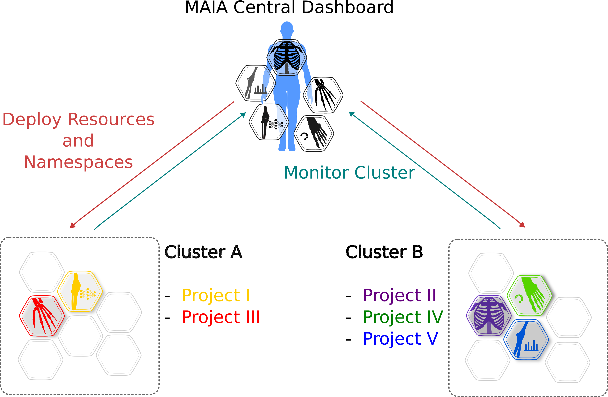
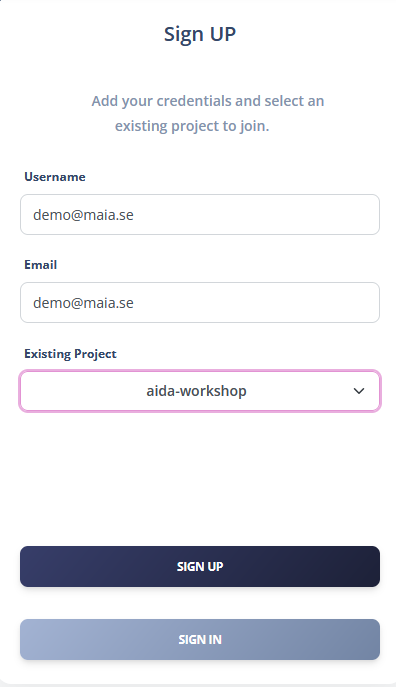
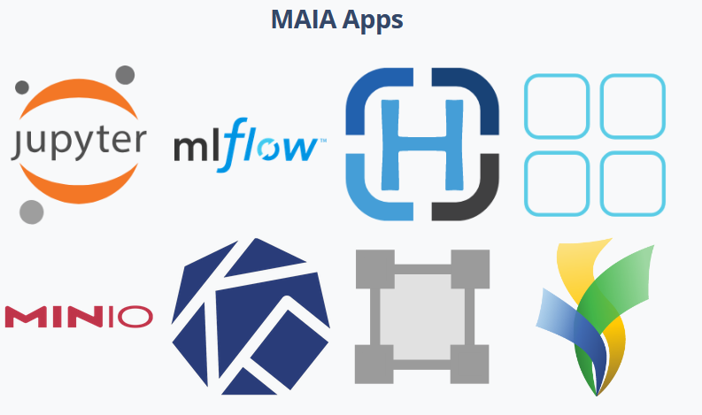
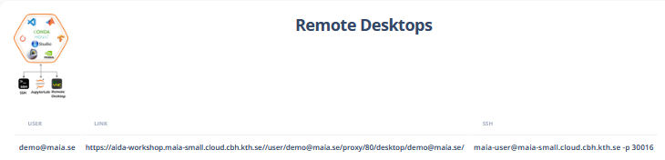
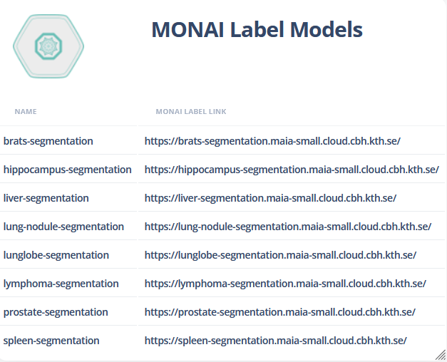
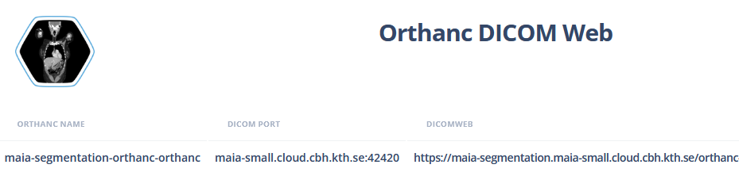
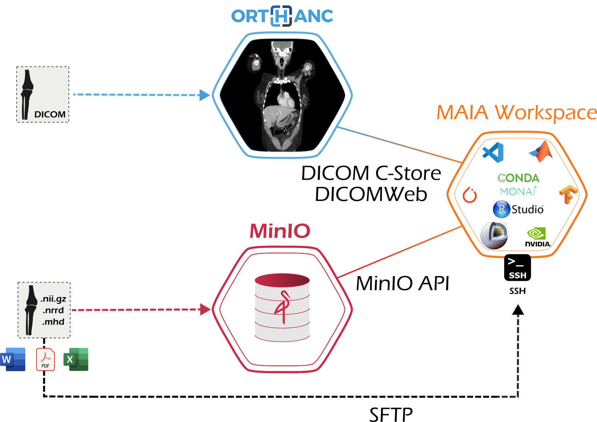
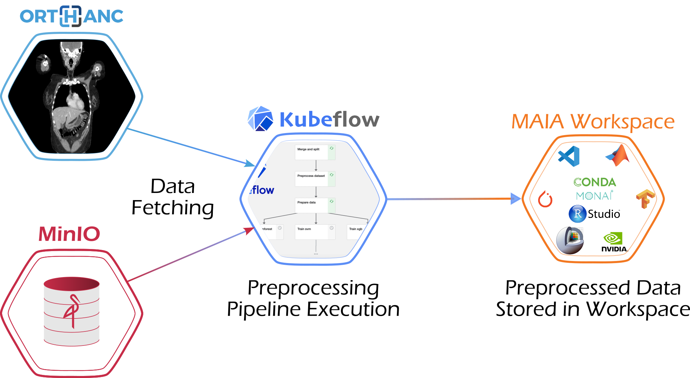
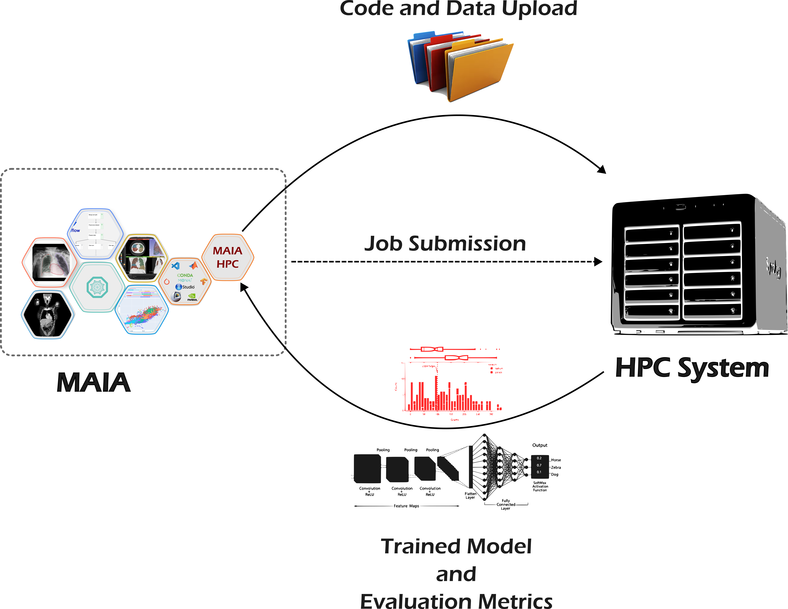

# MAIA-AIDA-TechDays-Workshop
Repository containing presentation slides and supporting materials for MAIA Tutorial, AIDA Technical Days, 17 September.

## Table of Contents
- [MAIA-AIDA-TechDays-Workshop](#maia-aida-techdays-workshop)
  - [Table of Contents](#table-of-contents)
  - [Introduction to MAIA](#introduction-to-maia)
    - [Why MAIA?](#why-maia)
    - [Learn More](#learn-more)
    - [MAIA in 5 minutes](#maia-in-5-minutes)
      - [MAIA Projects](#maia-projects)
    - [User Registration](#user-registration)
    - [MAIA Dashboard Overview](#maia-dashboard-overview)
      - [MAIA Project Page](#maia-project-page)
    - [Connect VSCode to your running MAIA Workspace](#connect-vscode-to-your-running-maia-workspace)
  - [Part 1: End-to-End Model Development and Deployment Workflow](#part-1-end-to-end-model-development-and-deployment-workflow)
    - [Overview](#overview)
    - [Prerequisites](#prerequisites)
    - [1.1 DICOM Transfer to Orthanc](#11-dicom-transfer-to-orthanc)
    - [1.1.2 DICOM Manual Annotation \[Optional\]](#112-dicom-manual-annotation-optional)
    - [1.2 DICOM to NIFTI Conversion](#12-dicom-to-nifti-conversion)
    - [1.3 Data Preparation and Preprocessing for Image Segmentation with nnUNet](#13-data-preparation-and-preprocessing-for-image-segmentation-with-nnunet)
  - [1.4 Model Training and Validation with nnUNet (Locally)](#14-model-training-and-validation-with-nnunet-locally)
    - [Features of the MAIA Workspace](#features-of-the-maia-workspace)
    - [Training with the MONet Bundle](#training-with-the-monet-bundle)
      - [MLFlow Integration](#mlflow-integration)
      - [Validation](#validation)
      - [Visualization with DTale](#visualization-with-dtale)
    - [1.5 Model Training and Validation with nnUNet \[HPC\]](#15-model-training-and-validation-with-nnunet-hpc)
      - [Running Jobs on HPC](#running-jobs-on-hpc)
      - [Requirements](#requirements)
      - [Data and Bundle Transfer](#data-and-bundle-transfer)
      - [Executing Jobs from MAIA-HPC](#executing-jobs-from-maia-hpc)
      - [Multi-GPU Training](#multi-gpu-training)
      - [Training Speedup](#training-speedup)
      - [Interactive Jupyter Sessions on HPC](#interactive-jupyter-sessions-on-hpc)
      - [Retrieving the Trained Model](#retrieving-the-trained-model)
      - [Converting the Checkpoint](#converting-the-checkpoint)
      - [Running Validation](#running-validation)
      - [Visualization with DTALe](#visualization-with-dtale-1)


## Introduction to MAIA

### Why MAIA?
<p align="center">
    
</p>
Artificial Intelligence in healthcare is advancing rapidly, with the potential to transform medical imaging, diagnostics, and patient care.  
Yet, one of the biggest challenges remains: the gap between **AI research** and its **real-world clinical application**.

**MAIA** was created to **bridge this gap**.  
It is an open-source platform designed to bring together **AI researchers and radiologists in the same collaborative space**. By doing so, MAIA promotes direct interaction between those developing algorithms and the professionals who apply them in clinical practice.

This approach enables:
- **Direct integration of AI into healthcare workflows**  
- **Faster translation of ideas into prototypes** and then into clinical testing  
- **Iterative improvement of AI models**, guided by real feedback from clinicians  
- **Cross-disciplinary collaboration**, ensuring innovations are grounded in clinical reality  

In short, MAIA is more than just a technical workspace, it is a **collaborative environment** where ideas can grow from **concept to deployment**. By promoting open collaboration, MAIA empowers the medical AI community to accelerate research, validate models in clinical contexts, and bring truly impactful innovations closer to patient care.

### Learn More

[](https://github.com/kthcloud/maia)  
[](https://arxiv.org/abs/2507.19489)  
[](https://maia.app.cloud.cbh.kth.se/)
### MAIA in 5 minutes

MAIA is a collaborative platform designed to manage Medical AI research efficiently and at scale. It brings together state-of-the-art, standards-based tools to cover every stage of the AI lifecycle in the medical domain, from data management and annotation to model training, deployment, and evaluation. Multiple projects can be independently hosted within MAIA, and each user can participate in one or more projects. Built as a federation of clusters, MAIA allows physically independent computing infrastructures to be unified under one platform, abstracting away the complexity so researchers can focus on collaboration and innovation without worrying about the underlying systems.

<p align="center">
    
</p>

#### MAIA Projects  

Each **MAIA Project** is provisioned with a dedicated *MAIA Namespace*, which serves as a container for all the applications required to develop, deploy, and curate medical images along with their corresponding AI models.  

- **Medical Images**: Managed through *Orthanc*, which acts as the project’s DICOM server and entry point for storing and accessing imaging data.  
- **Model Development & Scientific Computing**: Provided via the *MAIA Workspace* inside the namespace, giving users isolated or shared environments.  

Entrypoints to the workspace include:  
- Remote Desktop  
- Jupyter Interface  
- SSH Connection  

<p align="center">
  
</p>

### User Registration
To register in the MAIA Project, created for the MAIA Workshop, and getting access to the resources, please follow these steps:

1. Visit the [MAIA Project Registration Page](https://maia.app.cloud.cbh.kth.se/maia/register/).
2. Fill out the registration form with the required information. Under "Existing Project", select "**aida-workshop**".
3. Submit the form and check your email for a confirmation message.
4. Follow the instructions in the email to complete your registration.

Once registered, you will have access to all workshop materials and resources.
<p align="center">
    
</p>

### MAIA Dashboard Overview
After logging in, you will be directed to the MAIA Dashboard. Here, you can have an overview of the MAIA Cluster resources, including information about the status of each cluster and node.

On the side, there is a navigation bar that allows you to access the different project pages you are assigned to.
By clicking on a project name, you can switch between different projects and access their specific resources and tools.

#### MAIA Project Page
The MAIA Project page is structured in four main sections:

1. **MAIA Apps**: A collection of applications and tools available for use within the project.
<p align="center">
    
</p>

2. **Remote Desktops**: This section provides a table listing each project user, along with a direct link to their Remote Desktop interface for accessing the MAIA Workspace. It also includes the corresponding SSH command for connecting to the MAIA Workspace.
<p align="center">
    
</p>

3. **MONAI Label Models**: A list of available models, deployed for integration in inference pipelines (MAIA Segmentation Portal, PACS Integration through XNAT or Orthanc), and Active Learning
<p align="center">
    
</p>

4. **Orthanc DICOM Web**: A list of available Orthanc instances for the project, including a reference to the DICOMWeb and the DICOM C-GET and C-STORE endpoints.
<p align="center">
    
</p>


### Connect VSCode to your running MAIA Workspace

You can connect VSCode (or any other IDE through SSH), by following these steps:

1. Upload a new or an existing SSH key following the instructions on the [MAIA Welcome](https://github.com/kthcloud/MAIA/blob/master/docker/MAIA-Workspace/Welcome.ipynb) page in your MAIA Workspace (`/home/maia-user/Welcome.ipynb`), either from the Jupyter interface or the Remote Desktop
2. Retrieve the SSH command to execute either from the same [MAIA Welcome](https://github.com/kthcloud/MAIA/blob/master/docker/MAIA-Workspace/Welcome.ipynb) page or from the MAIA Dashboard, under the **Remote Desktops** table.

## Part 1: End-to-End Model Development and Deployment Workflow
### Overview
This section outlines a complete, day-by-day workflow for developing, training, and deploying a medical imaging AI model.  
The process begins with DICOM data transfer and manual annotation, continues through dataset conversion, preprocessing, and model training, and concludes with packaging, deployment, and inference on both NIfTI and DICOM inputs.  
By the end of this sequence, you will have built and deployed a model that is fully integrated into a clinical-style pipeline.


### Prerequisites
You will need a DICOM dataset to upload into MAIA.  

- To download a sample dataset, visit the [Decathlon Challenge](http://medicaldecathlon.com/) website or follow the instructions in [Kubeflow - Download Dataset from Decathlon Challenge](./Kubeflow.ipynb#Download-Spleen-Decathlon-Dataset).  
- Since the dataset is provided in NIfTI format, you will need to convert it to DICOM. Follow the steps in [Kubeflow - Convert NIfTI to DICOM](./Kubeflow.ipynb#Convert-NIFTI-to-DICOM).  

For convenience, an example DICOM dataset with 5 abdominal CT scans (converted from the Task09-Spleen Decathlon dataset) is available here:  
[MinIO - DICOM Spleen Dataset](https://aida-workshop.maia-small.cloud.cbh.kth.se/minio-console/api/v1/download-shared-object/aHR0cDovL21pbmlvLmFpZGEtd29ya3Nob3Auc3ZjLmNsdXN0ZXIubG9jYWwvc3BsZWVuL1NwbGVlbl9ESUNPTS56aXA_WC1BbXotQWxnb3JpdGhtPUFXUzQtSE1BQy1TSEEyNTYmWC1BbXotQ3JlZGVudGlhbD1WT0Q3SVFIQkZZVVhSSUFGWlI1OCUyRjIwMjUwOTAxJTJGdXMtZWFzdC0xJTJGczMlMkZhd3M0X3JlcXVlc3QmWC1BbXotRGF0ZT0yMDI1MDkwMVQxMzI1NDZaJlgtQW16LUV4cGlyZXM9NDMxOTkmWC1BbXotU2VjdXJpdHktVG9rZW49ZXlKaGJHY2lPaUpJVXpVeE1pSXNJblI1Y0NJNklrcFhWQ0o5LmV5SmhZMk5sYzNOTFpYa2lPaUpXVDBRM1NWRklRa1paVlZoU1NVRkdXbEkxT0NJc0ltRmpjaUk2SWpFaUxDSmhkRjlvWVhOb0lqb2lTbXg2WWtSWlJXTTJXbXRUYnpaU1JEQm9OVjg1WnlJc0ltRjFaQ0k2SW0xaGFXRWlMQ0poZFhSb1gzUnBiV1VpT2pFM05UWTNNek13Tmpjc0ltRjZjQ0k2SW0xaGFXRWlMQ0psYldGcGJDSTZJbk5wYldKbGJrQnJkR2d1YzJVaUxDSmxiV0ZwYkY5MlpYSnBabWxsWkNJNmRISjFaU3dpWlhod0lqb3hOelUyTnpZNU1EWTJMQ0ptWVcxcGJIbGZibUZ0WlNJNklrSmxibVJoZW5wdmJHa2lMQ0puYVhabGJsOXVZVzFsSWpvaVUybHRiMjVsSWl3aVozSnZkWEJ6SWpvaVRVRkpRVHBoYVdSaExYZHZjbXR6YUc5d0lpd2lhV0YwSWpveE56VTJOek16TURZNExDSnBjM01pT2lKb2RIUndjem92TDJsaGJTNWpiRzkxWkM1alltZ3VhM1JvTG5ObEwzSmxZV3h0Y3k5amJHOTFaQ0lzSW1wMGFTSTZJamRpTkdVNVkyRm1MVE5oWlRndE5EUmlZeTFoWlRjNExUaGxNV0ZqTVdaaE1qWXlNeUlzSW01aGJXVWlPaUpUYVcxdmJtVWdRbVZ1WkdGNmVtOXNhU0lzSW5CeVpXWmxjbkpsWkY5MWMyVnlibUZ0WlNJNkluTnBiV0psYmtCcmRHZ3VjMlVpTENKemFXUWlPaUkzWlRKa1lqQmpZeTAzWkdZd0xUUXpaVE10T1RJeFlTMHpPREF4TTJZeE9UbGxZVEVpTENKemRXSWlPaUkzWTJFNE1EQXdPQzFpTldWbUxUUmhZak10WWpJMVppMWlaV1E0WkRSbVpUUmpabU1pTENKMGVYQWlPaUpKUkNKOS5OMW40US04eEsycmxxeXVSOERvWGF0ZGdqQ2R4QkVfLU9JLWxYbEM1ZFlNSWszSU1PRHRjMTBKUU5reTB6eHhHMnNhN1pweXZGUDVveTUxZVM3SlQwUSZYLUFtei1TaWduZWRIZWFkZXJzPWhvc3QmdmVyc2lvbklkPW51bGwmWC1BbXotU2lnbmF0dXJlPThjMDM5MzE3MmNiYTY5ODg1YTFmYzY1MmY3MDMyZmNhNjZmOTAyYmY1Yzc2MDg5YmI0NTQ0N2JiZTFlYzhkODA)

### 1.1 DICOM Transfer to Orthanc  
<p align="center">
    
</p>

The first step in the AI lifecycle is transferring the DICOM dataset to a MAIA project, making it accessible for subsequent processing and model training. In MAIA, *Orthanc* serves as the entry point for sharing DICOM files within a project.  

Orthanc supports three methods for transferring DICOM files:  
- **DICOMWeb**  
- **DICOM C-STORE**  
- **Orthanc Web Interface**  

For DICOMWeb and C-STORE, you can find the relevant links (for DICOMWeb) and commands (for C-STORE) in the MAIA Dashboard under the **Orthanc DICOM Web** table.  

When using C-STORE, ensure your calling AE title follows the pattern specified in the Orthanc link, e.g., `aida-workshop.maia.se/orthanc-<your-ae-title>`. Alternatively, the AE Title can also be found in the **Modalities** section of the Orthanc Web interface.  

As a third option, files can be uploaded directly via drag-and-drop using the Orthanc Web UI.

Once uploaded, the DICOM files can be accessed, inspected, and visualized through the Orthanc instance along with its integrated OHIF viewer.

### 1.1.2 DICOM Manual Annotation [Optional]  

For supervised tasks, both the medical images and their corresponding annotated masks are required for the model to learn the desired task. Existing segmentation masks can be uploaded as DICOM SEG files using the same procedure as for the images through Orthanc. Alternatively, masks can be manually annotated using any of the tools available in MAIA:  

- **OHIF Viewer Annotation Tools**  
- **3D Slicer in the MAIA Workspace**: Link 3D Slicer to Orthanc as a DICOM server, download the images into Slicer, and upload the annotated masks. Upload can be done using either DICOMWeb or DICOM C-STORE protocols.  

The main advantage of using tools like 3D Slicer in the MAIA Workspace or the OHIF interface is that both the workspace and Orthanc are within the same internal network. This allows communication with Orthanc via its internal IP, e.g., `aida-workshop-orthanc-svc-orthanc:4242`, ensuring that the data never leave the platform and remain fully secure.

### 1.2 DICOM to NIFTI Conversion

<p align="center">
    
</p>
Most deep learning frameworks for medical image processing perform better with NIFTI images, where each case is stored as a single 3D volume along with its corresponding annotation mask, rather than using the native DICOM format. Therefore, it is necessary to export DICOM images and their associated DICOM SEG annotations into NIFTI format within the MAIA Workspace, ensuring the dataset is ready for downstream model training tasks.  

A Kubeflow Pipeline is available in MAIA to handle the DICOM-to-NIFTI conversion [DICOM-to-NIFTI_pipeline.yaml](./KubeFlow/Pipelines/DICOM_to_NIFTI_pipeline.yaml). To run it, specify the DICOM WEB url and the output directory for the NIFTI files:
```yaml
studies: <ORTHANC_DICOM_WEB_URL>
output_folder: /mnt/Data/NIFTI/Task09_Spleen
```
After the successful execution of the Pipeline, you will find the NIFTI converted dataset under `output_folder`.

### 1.3 Data Preparation and Preprocessing for Image Segmentation with nnUNet  

In this tutorial, we will use the **Spleen Dataset** to build a model for automatic spleen segmentation in CT images. The process will rely on the **MONet Bundle**, which provides an end-to-end workflow for model development, training, and packaging for deployment. The MONet Bundle is specifically designed to integrate the state-of-the-art **nnUNet** framework—the benchmark for medical image segmentation—within the MONet ecosystem, enabling seamless support for deployment, active learning, and federated learning.

Using the MONet Bundle is highly convenient, as it allows researchers to implement a complete, automated pipeline for bringing advanced segmentation models into clinical workflows. To get started, only a configuration file is required, where details about the dataset, training parameters, and task specifications are defined.

```yaml
data_dir: "/mnt/Data/Task09_Spleen" # Location of the dataset directory
nnunet_root_dir: "/mnt/Data/nnUNet" # Location where to create and populate the nnUNet directory
dataset_name_or_id: "09"            # A unique identifier for the task
dataset_format: "subfolders"        # The dataset directory format. Can be decathlon or subfolders
modality_dict:                      # Dictionary for identifying modalities and segmentation files from the suffix and extension
    image: ".nii.gz"
    label: ".nii.gz"
output_data_dir: "/mnt/Data/Task09_Spleen"
experiment_name: "Task09_Spleen_CIFS"  # Experiment name to use in MLflow
concat_modalities_flag: false          # Flag to configure modality concatenation in 4D volume. Only valid if the dataset has multimodal images.
labels:                                # Segmentation labels, including the background
    background: 0
    Spleen: 1
label_dict:
    Spleen: 1
bundle_config:
  bundle_root: "/mnt/Data/MONet_Bundle/Task09/MONetBundle"  # Where to save the MONet Bundle
  tracking_uri: "https://mlflow.fed-lymphoma.maia-small.se" # MLflow tracking server URI
  mlflow_run_name: "run_fold_0"                               # MLflow run name
continue_training: true                                     # Flag to continue training from a checkpoint [OPTIONAL]
run_validation_only: false                                 # Flag to run only the validation step at the end of training [OPTIONAL]
```
To run the Data Preparation and Preprocessing step, we create the corresponding Configuration file for our task:

```bash
mkdir -p /home/maia-user/shared/configs
cat <<EOF > /home/maia-user/shared/configs/Task09_Spleen_config.yaml
data_dir: /mnt/Data/NIFTI/Task09_Spleen
nnunet_root_dir: /mnt/Data/nnUNet
dataset_name_or_id: "09"
dataset_format: "subfolders"
modality_dict:
  image: "_image.nii.gz"
  label: "_label.nii.gz"
output_data_dir: /mnt/Data/NIFTI/Task09_Spleen
experiment_name: "Task09_Spleen"
concat_modalities_flag: false
labels:
  background: 0
  Spleen: 1
label_dict:
  Spleen: 1
bundle_config:
  bundle_root: "/mnt/Data/MONet_Bundle/Task09/MONetBundle"
  tracking_uri: "https://aida-workshop.maia-small.cloud.cbh.kth.se/mlflow"
  mlflow_run_name: "nnUNet"
EOF
```

And then we can run the KubeFlow pipeline for this step, [MONet-Pipeline-Plan-and-Preprocess](./KubeFlow/Pipelines/MONet_pipeline_Plan_and_Preprocess.yaml), specifying where to locate the configuration file:
```yaml
config_file_path: configs/Task09_Spleen_config.yaml
```


## 1.4 Model Training and Validation with nnUNet (Locally)

After completing data preparation and preprocessing, the dataset is ready for model training.  
The MAIA Workspace provides a complete Python environment with **Conda support**, so you can install any required packages for your experiments.  

You can train models using any framework, but this tutorial will focus on **nnUNet training with the MONet Bundle**.  

---

### Features of the MAIA Workspace
- **Full Python environment** with Conda  
- **SSH access** to run training scripts from your local machine (e.g., using VSCode or another IDE)  
- **GPU support** for faster training times  

---

### Training with the MONet Bundle
As with data preparation and preprocessing, we will use the **MONet Bundle** to streamline the training and validation process.  

The MONet Bundle includes:
- Data loading and augmentation  
- Model architecture definition (nnUNet)  
- Training loops and tracking  

We will reuse the same configuration file created during the data preparation step, which contains all necessary parameters for training.

To launch the training step, run the **KubeFlow pipeline**:  
[MONet-Pipeline-Train](./KubeFlow/Pipelines/MONet_pipeline_Train.yaml)  

Specify the configuration file location:  

```yaml
config_file_path: configs/Task09_Spleen_config.yaml
```

---

#### MLFlow Integration
When training with the MONet Bundle, all runs are automatically tracked in **MLFlow**, including:
- Training metrics  
- Hyperparameters  
- Model artifacts  

This enables:
- Easy monitoring of training progress  
- Comparison between different runs  
- Visualization of training curves and logs  
- Identification and debugging of potential issues  

---

#### Validation
Once training is complete, validation can be performed on the **validation split** to evaluate model performance.  

The MONet Bundle supports:
- Generating predictions with the trained model  
- Logging validation metrics (e.g., **Dice Score**, **Average Surface Distance**, **Hausdorff Distance 95**) into MLFlow  

To run validation, use the following KubeFlow pipeline:  
[MONet-Pipeline-Validation](./KubeFlow/Pipelines/MONet_pipeline_Validation.yaml)  

Specify the configuration file location:  

```yaml
config_file_path: configs/Task09_Spleen_config.yaml
```

---

#### Visualization with DTale
After validation, results can be explored with **DTale**.  

DTale provides:
- A user-friendly interface for analyzing validation results  
- Interactive plots and charts  
- Support for generating visual reports of model performance  

This makes it easy to **analyze, report, and compare** model outcomes for further research and refinement.

### 1.5 Model Training and Validation with nnUNet [HPC]

<p align="center">
    
</p>

One of the biggest features when using **MAIA** is its capability to integrate with external HPC clusters through the **MAIA-HPC interface**.  
This allows you to scale up the training process by leveraging multiple GPUs and larger compute resources.  
For example, you can move from training on a single GPU to training on **8 GPUs in parallel** (as available in the PDC cluster).

Detailed setup instructions can be found in:  
👉 [MAIA-HPC/README.md](./MAIA-HPC/README.md)

---

#### Running Jobs on HPC
Once configured, you are ready to:
1. Launch training jobs on the HPC cluster directly from the **MAIA Workspace**  
2. Retrieve the trained models back to MAIA for packaging and deployment  

---

#### Requirements
For running this tutorial on the HPC cluster, you need:
- A **Singularity container** with:
  - PyTorch `2.4.0` (with CUDA support)  
  - Required packages listed in [MAIA-HPC/requirements.txt](./MAIA-HPC/requirements.txt)  

---

#### Data and Bundle Transfer
The first step is to transfer the **MONet Bundle** and the **Dataset** to the HPC cluster.  
This can be done via:
- `sftp` command  
- Remote Desktop integration  
- Or the provided Python script:  
  [SFTP transfer](./KubeFlow/Scripts/SFTP_Pipeline.py)  

---

#### Executing Jobs from MAIA-HPC
You can execute jobs directly from the MAIA-HPC interface.  

To run the interface:

```bash
export BOKEH_ALLOW_WS_ORIGIN=aida-workshop.maia-small.cloud.cbh.kth.se
panel serve --dev HPC.ipynb --port 5006
```
And then access it via:
[MAIA-HPC](https://aida-workshop.maia-small.cloud.cbh.kth.se/user/<USER-EMAIL>/proxy/5006/HPC)

---

#### Multi-GPU Training
Remember to adjust the **batch size** to match the number of GPUs:  
- If the original batch size is `2` on a single GPU  
- With **8 GPUs**, the batch size should be increased to `16`  

The underlying training routine calls the same **MONet Bundle** training script, but executed through **PyTorch Lightning DDP**, which handles multi-GPU distribution automatically.

---

#### Training Speedup
Training time differences can be significant:
- On a **single GPU**, training the spleen dataset may take ~2 days  
- On **8 GPUs**, the same training can be reduced to ~8 hours  

#### Interactive Jupyter Sessions on HPC
If you prefer to run an **interactive Jupyter session** on the HPC, you can replace the experiment command with:

```bash
jupyter lab --ip 0.0.0.0 --port 8888 --no-browser --allow-root \
--NotebookApp.token='' --NotebookApp.password='' --notebook-dir $ROOT_DIR
```

Then, create an SSH tunnel from your local machine:

```bash
ssh -L 8889:<HPC-COMPUTE-NODE>:8888 <SERVER>
```

Finally, open your browser inside the MAIA Workspace at:  
👉 [http://localhost:8889](http://localhost:8889)

---


#### Retrieving the Trained Model
Once training is complete, you can retrieve the trained model back to **MAIA** for validation (as in the local training section).  

For transferring the model, use one of the following:
- `sftp`  
- Remote Desktop integration  
- Python script: [SFTP transfer](./KubeFlow/Scripts/SFTP_Pipeline.py)  

---

#### Converting the Checkpoint
Before validation, convert the **PyTorch Lightning checkpoint** into a standard **PyTorch model** compatible with the MONet Bundle.  

We provide a KubeFlow pipeline for this step:  
👉 [MONet-Pipeline-Convert-CKPT-to-PT](./KubeFlow/Pipelines/MONet_pipeline_Convert_CKPT_to_PT.yaml)  

Specify the configuration file location:

```yaml
config_file_path: configs/Task09_Spleen_config.yaml
```

---

#### Running Validation
After conversion, you can run the validation step.  
To generate predictions, modify the configuration file (`/home/maia-user/shared/configs/Task09_Spleen_config.yaml`) by setting:

```yaml
run_validation_only: true
```

Then:
1. Execute the **KubeFlow training pipeline** (with the above flag enabled)  
2. Execute the **KubeFlow validation pipeline** (as described in the local training section)  

---

#### Visualization with DTALe
Finally, visualize the results with **DTALe**, as described in the local training section.  
DTALe provides interactive plots and metrics exploration for evaluating model performance.